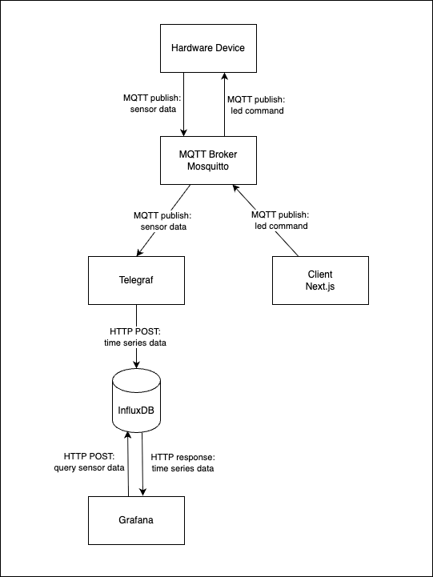
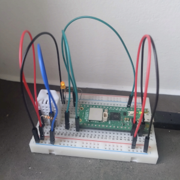
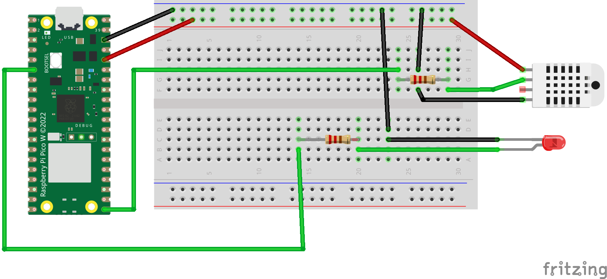
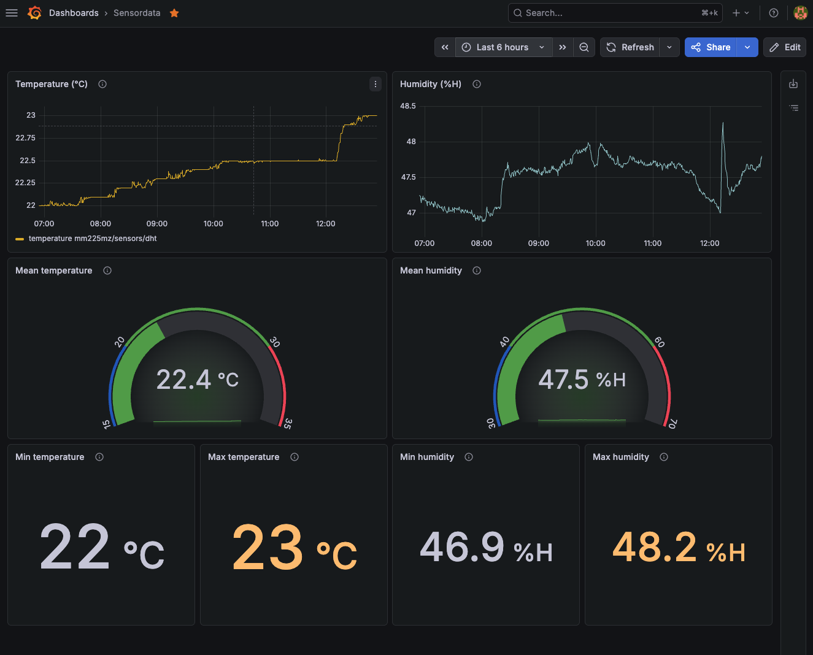

# IoT - Temperature and humidity sensor 🌡️💦

This IoT application collects temperature and humidity data from a sensor and displays the information on a Grafana dashboard.  
The dashboard lets the user monitor sensor data both on a timeline and as aggregated values (minimum, maximum and mean). To alert the user, the text color changes if the aggregated values are beyond or below threshold values.
The client interface lets the user toggle the led light and view a snapshot from Grafana.

## Scope
> This application was developed as a school project for the course [1DV027](https://kursplan.lnu.se/kursplaner/kursplan-1DV027-1.000.pdf).

## Links
- [Grafana snapshot, 2025-05-19, 00:00 - 23:59](https://grafana.mariamair.se/dashboard/snapshot/EGSRvBfjK06ElWEGCiPVOysH48fwfpVD)
- [Client app](https://iot.mariamair.se)

## Architecture and data flow
Data moves in two directions:
- Hardware device -> MQTT broker -> Telegraf -> InfluxDB -> Grafana.
- Client -> MQTT command topic -> device action.  

**Architecture diagram**



## Hardware setup
| Image | Description |
| --- | --- |
|  | * Raspberry Pi Pico W <br> * DHT22 temperature and humidity sensor <br> * Led light |
|  | Fritzing diagram showing the connections |

--- 

> _Note: `<my-namespace>` and `<my-bucket>` in the examples below serve as placeholder for the implemented names._

##  MQTT setup (Mosquitto)
| Subject | Description |
| --- | --- | 
| Broker | Self-hosted MQTT Broker (Mosquitto) |
| Security | Authentication and communication via TLS is required. Unencrypted communication and anonymous access is not allowed. <br> Access is restricted so only necessary operations can be performed by each tool. |  
| Quality of Service | Level 0 is used since the applications is very small and does not handle critical data. |
| Retain and Last Will | Not implemented for sensor data. |

### Topics and payloads
`<my-namespace>/sensors/dht`
````json
      {
          "temperature": 24.1,
          "humidity": 46.7
      }
````

`<my-namespace>/commands/led`
````
      "on"
````

## Telegraf setup
  | Communication with | Authentication | Operations |
  | --- | --- | --- |
  | MQTT | Username + password | Can only read topic `<my-namespace>/sensors/#`. Has no write access. |
  | InfluxDB | Write-only access token | Can only write to bucket `my-bucket`. Has no read access. | 

## Database setup (InfluxDB)
| Subject | Description |
| --- | --- |
| Database version | InfluxDB version 2 |
| Data model | Data is sent as JSON from the hardware in short intervals and saved as time series data in InfluxDB. |
| Security | Tokens are used for authentication. Different tokens for different tools and clients. |
| Retention policy | Data older than 30 days is deleted. Once a day data from the last two days is downsampled to hourly data (mean value) and stored in a separate bucket. The downsample uses a one day overlap in case the previous day's downsampling has failed. |
| Indexing | InfluxDB uses a Time Series Index to ensure fast queries even with lots of data. |
| Query strategy | Flux is used for querying the time series data because it works well with InfluxDB 2.
| Aggregation | Flux queries in Grafana are used to aggregate data. |


## Client application setup
This project contains a simple client application written in React/Next.js. It is used to toggle the led light of the hardware and to link to a Grafana snapshot. 

| Communication with | Authentication | Operations |
| --- | --- | --- |
| MQTT | Username + password | Can only write to topic `<my-namespace>/commands/#`. No read access. |
| InfluxDB | N/A | No access. |
| Grafana | N/A| No direct access. Can only display a pre-saved snapshot. |

## Grafana setup
| Communication with | Authentication | Operations |
| --- | --- | --- |
| MQTT | N/A | No access. |
| InfluxDB | Read-only access token | Can read buckets `my-bucket` and `my-bucket_downsampled`. Has no write access.  |


### Flux query language
Version 2 of InfluxDB uses Flux as query language. Flux' built in aggregate function was very valuable for Grafana's performance, and I saw a clear difference in performance when using queries without it.  

#### Flux query example
  ````
  from(bucket: "my-bucket")
  |> range(start: v.timeRangeStart, stop: v.timeRangeStop)
  |> filter(fn: (r) => r["_measurement"] == "mqtt_consumer")
  |> filter(fn: (r) => r["_field"] == "humidity")
  |> filter(fn: (r) => r["topic"] == "<my-namespace>/sensors/dht")
  |> aggregateWindow(every: v.windowPeriod, fn: mean, createEmpty: false)
  |> yield(name: "mean")
  ````

### Grafana dashboard 
 
